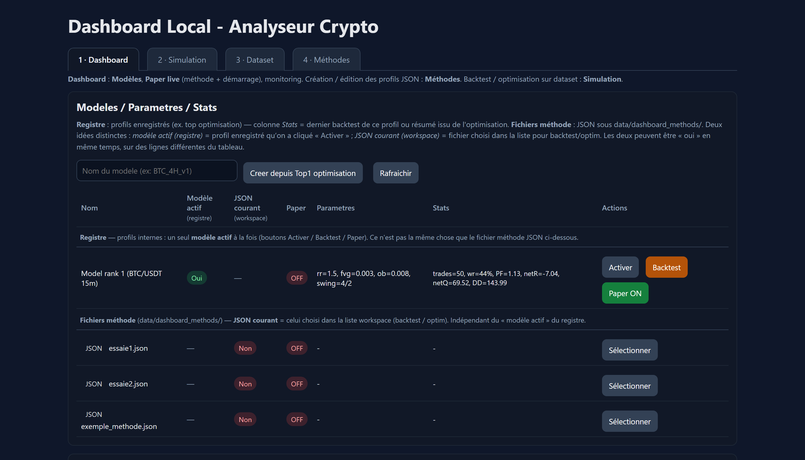

[🇬🇧 English](README.md) | [🇫🇷 Français](README.fr.md)

# Analyseur Crypto

<p align="center">
  
</p>

A multi-timeframe **crypto market structure analyzer** for Bitget, written in
Python, with a paper trading engine, a deterministic setup generator, a
FastAPI dashboard, and a Telegram bot for live alerts and remote control.
Smart-money-concepts toolkit (BOS / CHOCH / FVG / order block detection) +
classical chart patterns, all rule-based and unit-tested.

The project sits between "trading bot" and "research lab": setups are produced
by transparent rules (no opaque model), every backtest is reproducible, and
the methodology is documented in [docs/RESEARCH_NOTES.md](docs/RESEARCH_NOTES.md)
so a reader can tell what is supported by evidence and what is still a hypothesis.

> Research and educational tool. Not financial advice. Read [DISCLAIMER.md](DISCLAIMER.md).

---

## What it does

- **Market structure detection.** Swings (fractal pivots), support / resistance
  clustering, BOS, CHOCH, FVG, order blocks, RSI divergences, channels,
  wedges, flags, rectangles, triangles, and reversal patterns — all
  deterministic, all unit-tested on synthetic datasets.
- **Setup generation.** Rule-based confluence scoring with explicit weights.
  No black box.
- **Paper trading engine.** Live paper execution plus a historical replay
  backtest with broker parity tests, killswitch, drawdown limits.
- **REST API.** 17 routers under FastAPI, OpenAPI docs at `/docs`.
- **Dashboards.** Two HTML views: a market dashboard and a patterns
  dashboard. Plain Jinja templates, no JS framework.
- **Telegram bot.** Commands include `/start`, `/help`, `/perf`, `/open`,
  `/trades`, `/scan`, `/dashboard`, `/exec_status`, `/emergency_stop`,
  `/reset_killswitch`. Inline keyboards for callbacks.
- **Storage.** SQLAlchemy 2 async, SQLite for dev, PostgreSQL for prod.
  Alembic migrations.
- **206 unit tests.** Covering market structure, the backtest engine,
  pattern detectors, the hypothesis lifecycle, safety killswitch, and the
  ML feature pipeline stub.

## What it does NOT do

- It does not auto-trade with your money out of the box. Live mode is opt-in
  and requires Bitget API credentials and explicit configuration.
- It does not predict price. Detected patterns are descriptive — the
  research notes are explicit about which ones have measurable predictive
  value and which have been refuted on holdout.
- No ML model is currently used in production scoring. There is a feature
  snapshot writer and a placeholder ranker (`app.ml`), but the live
  pipeline is rule-based.

---

## Quick start

```bash
git clone https://github.com/alexch03/analyseur-crypto
cd analyseur-crypto

python -m venv .venv
.venv/Scripts/activate           # Windows
# source .venv/bin/activate      # Linux/macOS
pip install -e ".[dev]"

cp .env.example .env             # then edit .env
alembic upgrade head             # build the SQLite schema

uvicorn src.app.main:app --reload
# -> http://localhost:8000
# -> http://localhost:8000/docs
```

The Telegram bot runs separately:

```bash
python -m src.app.tg_bot.bot
```

(Windows: `start_telegram.bat` does the same.)

## Tests

```bash
pytest
```

206 tests run in about 10 seconds. They do not hit the network — exchange
calls and Telegram are mocked.

## Configuration

Everything is in `.env`. Highlights from `.env.example`:

| Variable | What it is |
|---|---|
| `DATABASE_URL` | SQLite (default) or `postgresql+asyncpg://...` for prod |
| `EXCHANGE_ID` | `binance` or `bitget` via ccxt |
| `SYMBOLS` | comma-separated watchlist, e.g. `BTC/USDT,ETH/USDT,SOL/USDT` |
| `TIMEFRAMES` | `5m,15m,1h,4h,1d` |
| `SCAN_INTERVAL_SECONDS` | poll frequency for the live scanner |
| `TELEGRAM_BOT_TOKEN` | from @BotFather (optional) |
| `TELEGRAM_ADMIN_CHAT_ID` | your chat id |
| `EXECUTION_MODE` | `paper` (default), `dry`, or `live` |
| `API_KEY` | header for the FastAPI admin endpoints |

## Architecture

```
src/app/
  api/                17 FastAPI routers (backtest, candles, chart, control,
                       dashboard, health, hypotheses, admin, analytics,
                       execution, ingestion, regime, settings, scan,
                       scanner_ops, signals, unit_paper)
  market_structure/   swings, BOS, CHOCH, FVG, order blocks, RSI,
                       support/resistance, divergences (7 modules)
  paper/              live paper engine + historical replay backtest
  strategy/           rule-based setup generator + confluence scoring
  execution/          Bitget client (ccxt async)
  tg_bot/             Telegram bot, notifier, command handlers
  db/                 SQLAlchemy models, migrations via Alembic
  web/                Jinja templates (dashboard + patterns)
  ml/                 feature snapshot writer + ranker placeholder
```

Modules talk through typed `Protocol` interfaces and frozen dataclass DTOs,
so each layer is mockable in tests.

## Roadmap

See [docs/RESEARCH_NOTES.md](docs/RESEARCH_NOTES.md) for the pre-registered
experimental plan: which hypotheses are open, which have been refuted on
holdout, and how the holdout is locked.

## License

MIT — see [LICENSE](LICENSE).

## Disclaimer

Research and educational use only. Trading derivatives is risky and not
suitable for everyone. Read [DISCLAIMER.md](DISCLAIMER.md) before going
anywhere near live mode.
